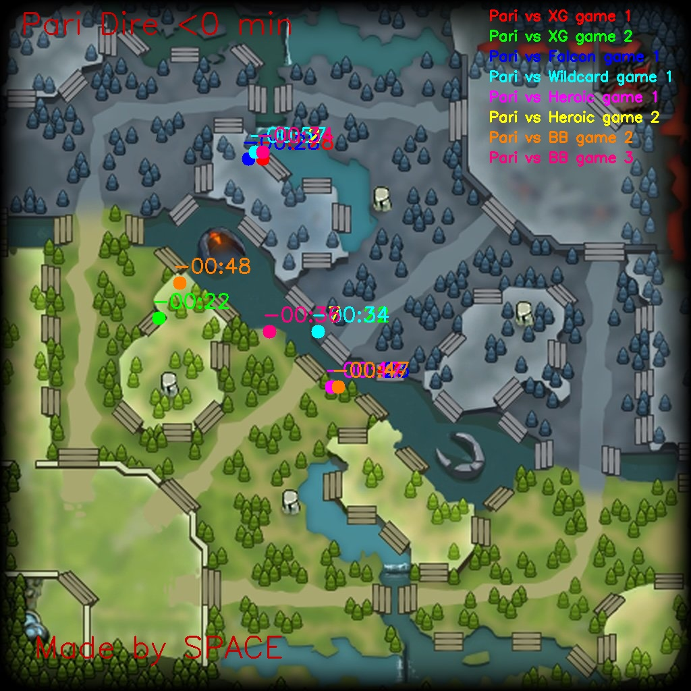
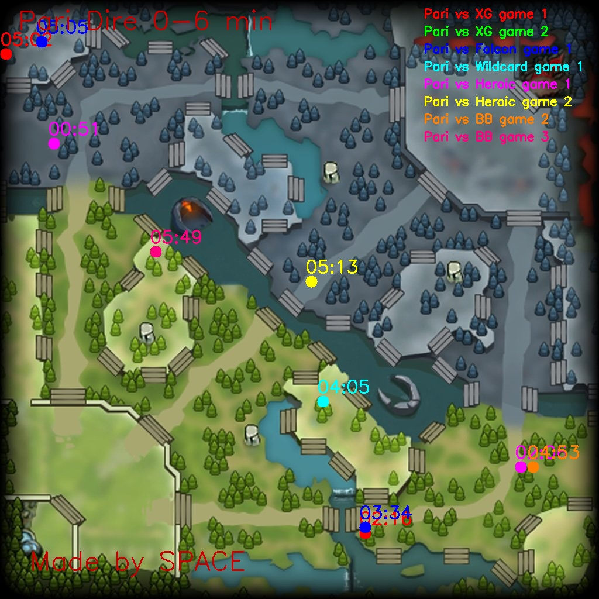
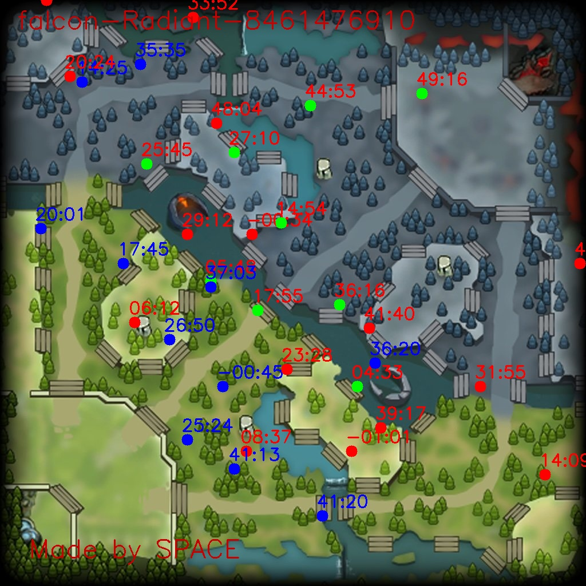

# Dota 2 视野分析工具 - TI14

[English](README_EN.md)

基于Python的专业Dota 2比赛视野控制分析工具（守卫插眼、烟雾使用），专门针对TI14（国际邀请赛2014）战队Falcon和Team Parivision。

## 项目概述

本项目处理来自DOTABUFF的HTML比赛数据，提取并可视化Dota 2地图上的视野相关事件（侦查守卫插放、摧毁和诡计之雾使用）。生成全面的分析报告和可视化图表，帮助理解战队在不同游戏阶段的视野策略。

## 功能特性

- **视野事件提取**：从DOTABUFF HTML文件中解析侦查守卫插放、摧毁和烟雾使用
- **时间轴分析**：按游戏阶段分类事件（赛前、0-6分钟、6-12分钟、12-20分钟、20-40分钟、40分钟以上）
- **战队可视化**：为天辉/夜魇阵营分别生成分析
- **多场比赛对比**：叠加多场比赛以识别模式
- **单场比赛分析**：详细的单场比赛视野分析，包含敌方守卫摧毁追踪




*图表：Team Parivision夜魇方历史比赛守卫插放位置 - 展示不同时间段的视野模式（赛前和0-6分钟）*



*图表：决赛第1场 - Team Falcon天辉方守卫插放分析。绿色圆圈表示被摧毁的守卫，红色圆圈表示未被摧毁的守卫，蓝色圆圈表示烟雾使用位置。*

## 数据来源

HTML数据文件从**DOTABUFF**下载，具体来自比赛页面的"Vision"标签。使用浏览器打开链接 https://www.dotabuff.com/matches/8461854486/vision ，将数字替换为**比赛ID**。每个HTML文件包含详细的比赛日志和视野事件，包括：

- 侦查守卫插放位置和精确地图坐标
- 侦查守卫摧毁记录
- 诡计之雾激活记录
- 时间戳和英雄信息
- 阵营信息（天辉/夜魇）

## 项目结构

```
dota2/
├── data_falcon/          # Falcon战队比赛HTML文件
├── data_pari/           # Team Pari战队比赛HTML文件
├── output_falcon/       # Falcon分析结果输出
├── output_pari/         # Team Pari分析结果输出
├── game_falcon.csv      # Falcon比赛元数据
├── game_pari.csv        # Team Pari比赛元数据
├── dota2_map.jpg        # Dota 2基础地图图像
├── history_vision.py    # 主要批量分析脚本
├── single_game_vision.py # 单场比赛分析脚本
└── requirements.txt     # Python依赖包
```

## 使用方法

### 安装说明
安装依赖：
```bash
pip install -r requirements.txt
```

### 批量分析（多场比赛）

分析特定战队的所有比赛：

```bash
# 分析Falcon战队比赛
python history_vision.py --team falcon

# 分析Team Pari战队比赛
python history_vision.py --team pari
```

此命令生成：
- **CSV文件**：单场比赛事件数据（`{阵营}_{比赛ID}.csv`）
- **视野热力图**：按时间阶段显示守卫插放模式
- **烟雾分析**：不同游戏时期的烟雾使用模式

### 单场比赛分析

分析特定比赛，包含详细的敌方视野追踪：

```bash
python single_game_vision.py --team falcon --game_id 8461854486 --our_side Dire --enemy_team pari
```

参数说明：
- `--team`：你的战队（falcon/pari）
- `--game_id`：要分析的特定比赛ID
- `--our_side`：你的战队阵营（Radiant/Dire）
- `--enemy_team`：敌方战队名称（falcon/pari）

## 输出文件

### 生成的可视化图表

1. **基于时间的守卫地图**：`{阵营}_before_{分钟数}_minutes.jpg`
   - 显示特定时间段的守卫插放位置
   - 按不同比赛颜色编码
   - 包含英雄名称和时间戳

2. **烟雾分析地图**：`{战队}Smoke-{阵营} {时间范围}.jpg`
   - 各游戏阶段的烟雾使用模式
   - 过滤刷屏（最小1分钟间隔）

3. **单场比赛分析**：`{战队}-{阵营}-{比赛id}.jpg`
   - 敌方守卫和己方守卫摧毁的综合视图
   - 红色圆圈：敌方守卫插放
   - 蓝色圆圈：敌方烟雾使用
   - 绿色圆圈：己方守卫摧毁

### 数据文件

- **事件CSV**：包含解析事件的列：
  - `time`：游戏时间戳
  - `action`：原始事件描述
  - `key_action`：分类动作（placed/destroyed/smoke）
  - `side`：战队阵营（Radiant/Dire）
  - `hero`：英雄名称
  - `position`：地图坐标（百分比和像素）

## 游戏数据格式

CSV文件（`game_falcon.csv`，`game_pari.csv`）包含比赛元数据：
- `场次`：比赛描述
- `{战队} 天辉/夜魇`：战队阵营
- `胜者`：获胜方
- `比赛id`：比赛ID（对应DOTABUFF比赛ID）

## 技术细节

### 视野事件检测

解析器识别三种关键事件类型：
1. **守卫插放**："placed Observer Ward"事件
2. **守卫摧毁**："destroyed Observer Ward"事件
3. **烟雾使用**："activated"事件（诡计之雾）

### 坐标系统

- HTML百分比转换为Dota 2地图上的像素坐标
- 地图尺寸从`dota2_map.jpg`中提取
- 坐标代表精确的游戏内位置

### 时间处理

- 支持MM:SS和HH:MM:SS格式
- 赛前事件（负时间戳）单独处理
- 事件按可配置时间段过滤和分组
