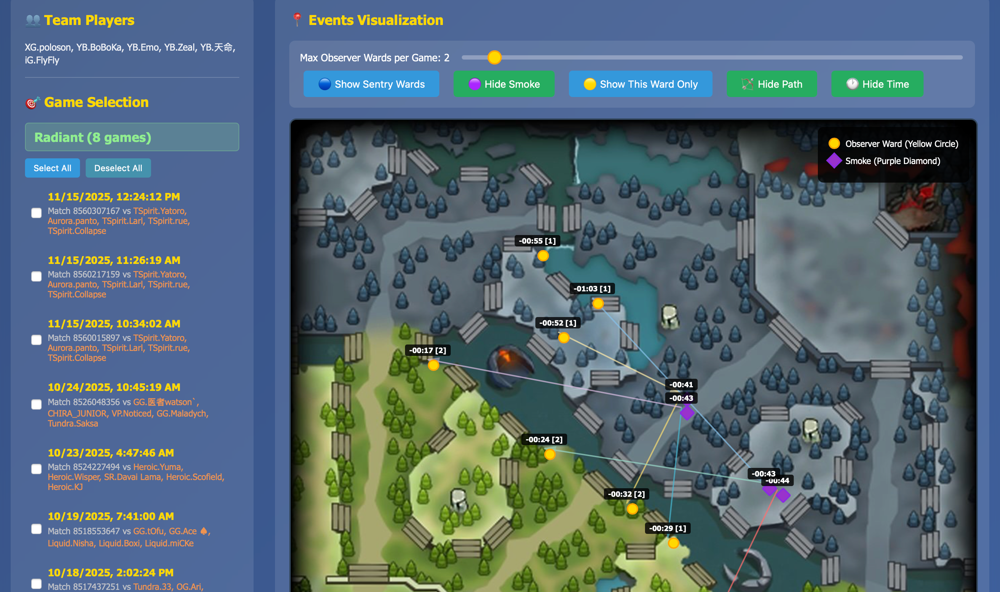

# Dota 2 Game Vision Visualizer

A comprehensive tool for analyzing vision control (ward placement, smoke usage) in professional Dota 2 matches. This project includes both a **web-based interactive visualizer** and **Python scripts** for generating analysis data from DOTABUFF match logs.

🌐 **Live Demo**: [https://dota2-bkb.github.io/ti14-vision/](https://dota2-bkb.github.io/ti14-vision/)

## 🎯 Quick Start - Web Visualizer

### Option 1: Use Sample Data
1. Visit the **[Live Demo](https://dota2-bkb.github.io/ti14-vision/)**
2. Download the sample CSV file: [`assets/events_summary.csv`](assets/events_summary.csv)
3. Click "📁 Choose CSV File" and upload the sample data
4. Explore the interactive visualization with:
   - Game selection by Radiant/Dire sides
   - Observer ward limit slider
   - Toggle controls for sentry wards, smoke events, paths, and time labels
   - "Show This Ward Only" mode for focused analysis

### Option 2: Use Your Own Data
1. Generate your own CSV file using the Python scripts (see [Data Generation](#-data-generation) below)
2. Upload your custom `events_summary.csv` to the web visualizer
3. Analyze your team's vision patterns and strategies

## 📸 Screenshots

### Web Visualizer Demo

*Interactive web visualizer showing game selection, event controls, and real-time map visualization with observer wards, paths, and statistics*

### Generated Analysis Results

*Example analysis output: YB team Dire side ward placement patterns across top 5 games, showing observer ward positions with timestamps and movement paths*

## 📊 Features

### Web Visualizer
- **Interactive Map**: Click and hover on events for detailed information
- **Game Filtering**: Select specific games by Radiant/Dire sides
- **Event Controls**: 
  - Observer ward limit slider (1-20 wards per game)
  - Toggle sentry wards, smoke events, movement paths, and time labels
  - Observer-only mode for focused ward analysis
- **Real-time Statistics**: Live stats showing selected games and event counts
- **Team Players Display**: Shows all team members from loaded games

### Data Analysis
- **Vision Event Extraction**: Parse Observer Ward placements, destructions, and Smoke usage from DOTABUFF HTML files
- **Timeline Analysis**: Categorize events by game phases (pre-game, 0-6min, 6-12min, 12-20min, 20-40min, 40+min)
- **Team-based Analysis**: Generate separate analysis for Radiant/Dire sides
- **Multi-game Comparison**: Overlay multiple games to identify patterns

## 🔧 Data Generation

### Prerequisites

1. **Clone the repository**:
```bash
git clone https://github.com/dota2-bkb/ti14-vision.git
cd ti14-vision
```

2. **Install Python dependencies**:
```bash
pip install -r requirements.txt
```

### Step 1: Download DOTABUFF Data

The HTML data files are downloaded from **DOTABUFF**, specifically from the "Vision" tab of match pages.

1. **Get Match ID**: Find your match ID from DOTABUFF or in-game
2. **Visit Vision Page**: Go to `https://www.dotabuff.com/matches/{MATCH_ID}/vision`
   - Example: `https://www.dotabuff.com/matches/8461854486/vision`
3. **Save HTML**: Right-click → "Save As" → Save as HTML file
4. **Organize Files**: Place HTML files in appropriate folders:
   - `data_falcon/` - For Falcon team matches
   - `data_pari/` - For Team Parivision matches  
   - `data_yb/` - For your team matches

Each HTML file contains detailed match logs with vision events including:
- Observer Ward placements with exact map coordinates
- Observer Ward destructions
- Smoke of Deceit activations
- Timestamps and hero information
- Side (Radiant/Dire) information

### Step 2: Generate CSV Data

Use the `vision_smoke_moving.py` script to process HTML files and generate CSV data:

```bash
# Process all HTML files in a directory
python vision_smoke_moving.py
```

This script will:
1. **Parse HTML files** from data directories (`data_falcon/`, `data_pari/`, `data_yb/`)
2. **Extract vision events** (ward placements, destructions, smoke usage)
3. **Generate CSV files** with event data, player information, and game metadata
4. **Output results** to corresponding directories (`output_falcon/`, `output_pari/`, `output_yb/`)

### Step 3: Use Generated Data

The script generates `events_summary.csv` files containing:
- **Events**: JSON-formatted event data with positions and timestamps
- **Hero Players**: Your team's player names mapped to heroes
- **Hero Players Against**: Opponent team's player names
- **Side**: Team side (Radiant/Dire)
- **Game ID**: Match identifier
- **Game Time**: Match timestamp


## 🔍 Event Types

The visualizer supports three main event types:

1. **Observer Wards** (Yellow Circles)
   - Numbered by placement order `[1]`, `[2]`, etc.
   - Essential for map vision and enemy movement tracking

2. **Sentry Wards** (Blue Squares)  
   - Used for dewarding and invisible unit detection
   - Toggleable in the visualizer

3. **Smoke of Deceit** (Purple Diamonds)
   - Team movement and gank coordination
   - Filtered to avoid duplicate events from multiple heroes

## 🤝 Partnership

Interested in partnerships or collaborations? Contact us to explore opportunities in Dota 2 analytics and esports data visualization.


## 🔗 Links

- **Live Demo**: [https://dota2-bkb.github.io/ti14-vision/](https://dota2-bkb.github.io/ti14-vision/)
- **GitHub Repository**: [https://github.com/dota2-bkb/ti14-vision](https://github.com/dota2-bkb/ti14-vision)
- **DOTABUFF**: [https://www.dotabuff.com/](https://www.dotabuff.com/) (Data source for match logs)
