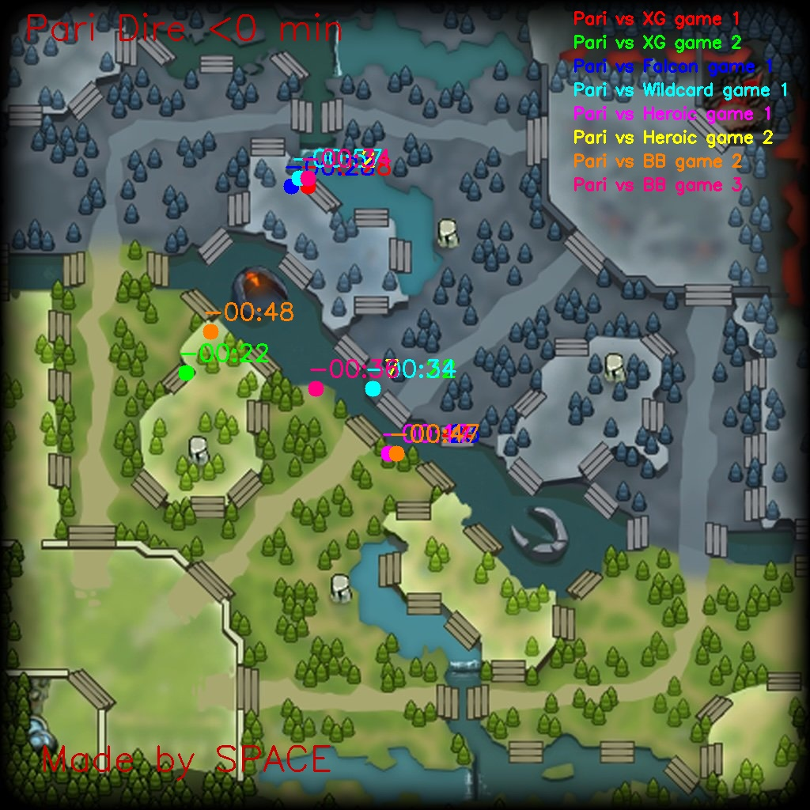
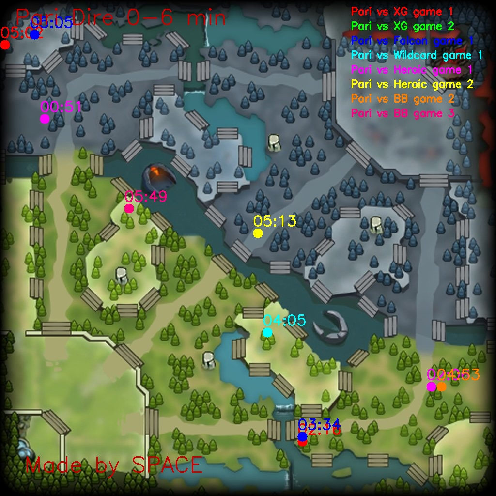
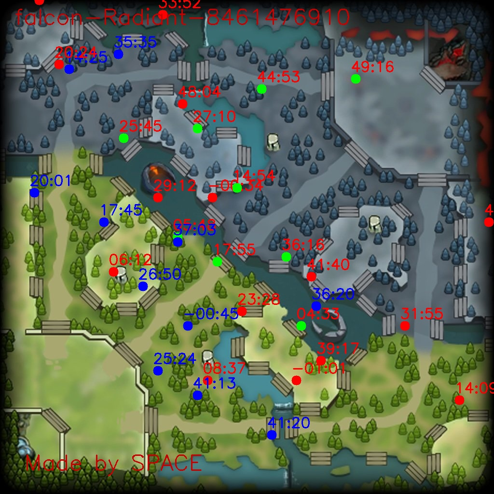

# Dota 2 Vision Analysis - TI14

A Python-based tool for analyzing vision control (ward placement, smoke usage) in professional Dota 2 matches, specifically focused on TI14 (The International 2014) teams Falcon and Team Parivision.

## Overview

This project processes HTML match data from DOTABUFF to extract and visualize vision-related events (Observer Ward placements, destructions, and Smoke of Deceit usage) on the Dota 2 map. It generates comprehensive analysis reports and visualizations to help understand team vision strategies across different game phases.

## Features

- **Vision Event Extraction**: Parse Observer Ward placements, destructions, and Smoke usage from DOTABUFF HTML files
- **Timeline Analysis**: Categorize events by game phases (pre-game, 0-6min, 6-12min, 12-20min, 20-40min, 40+min)
- **Team-based Visualization**: Generate separate analysis for Radiant/Dire sides
- **Multi-game Comparison**: Overlay multiple games to identify patterns
- **Individual Game Analysis**: Detailed single-game vision analysis with enemy ward destruction tracking




*Figure: Past game ward placements for Team Parivision on Dire side - showing vision patterns across different time periods (pre-game and 0-6 minutes)*



*Figure: Final game #1 - Team Falcon ward placement analysis on Radiant side. Green circles indicate destroyed wards, red circles show wards that were never destroyed, and blue circles represent smoke usage locations.*


## Data Source

The HTML data files are downloaded from **DOTABUFF**, specifically from the "Vision" tab of match pages. I use the browser to open the link (https://www.dotabuff.com/matches/8461854486/vision)[https://www.dotabuff.com/matches/8461854486/vision], replace the number with the **Game Match ID**  Each HTML file contains detailed match logs with vision events including:

- Observer Ward placements with exact map coordinates
- Observer Ward destructions
- Smoke of Deceit activations
- Timestamps and hero information
- Side (Radiant/Dire) information

## Project Structure

```
dota2/
├── data_falcon/          # Falcon team match HTML files
├── data_pari/           # Team Pari match HTML files
├── output_falcon/       # Generated Falcon analysis results
├── output_pari/         # Generated Team Pari analysis results
├── game_falcon.csv      # Falcon match metadata
├── game_pari.csv        # Team Pari match metadata
├── dota2_map.jpg        # Base Dota 2 map image
├── history_vision.py    # Main batch analysis script
├── single_game_vision.py # Single game analysis script
└── requirements.txt     # Python dependencies
```

## Installation

1. Clone the repository:
```bash
git clone <repository-url>
cd dota2
```

2. Install dependencies:
```bash
pip install -r requirements.txt
```

## Usage

### Batch Analysis (Multiple Games)

Analyze all games for a specific team:

```bash
# Analyze Falcon team games
python history_vision.py --team falcon

# Analyze Team Pari games
python history_vision.py --team pari
```

This generates:
- **CSV files**: Individual game event data (`{Side}_{GameID}.csv`)
- **Vision heatmaps**: Ward placement patterns by time phases
- **Smoke analysis**: Smoke usage patterns across different game periods

### Single Game Analysis

Analyze a specific match with detailed enemy vision tracking:

```bash
python single_game_vision.py --team falcon --game_id 8461854486 --our_side Dire --enemy_team pari
```

Parameters:
- `--team`: Your team (falcon/pari)
- `--game_id`: Specific match ID to analyze
- `--our_side`: Your team's side (Radiant/Dire)
- `--enemy_team`: Enemy team name (falcon/pari)

## Output Files

### Generated Visualizations

1. **Time-based Ward Maps**: `{Side}_before_{minutes}_minutes.jpg`
   - Shows ward placements for specific time periods
   - Color-coded by different games
   - Includes hero names and timestamps

2. **Smoke Analysis Maps**: `{Team}Smoke-{Side} {time_range}.jpg`
   - Smoke usage patterns across game phases
   - Filtered to avoid spam (minimum 1-minute intervals)

3. **Single Game Analysis**: `{team}-{side}-{game_id}.jpg`
   - Combined view of enemy wards and your ward destructions
   - Red circles: Enemy ward placements
   - Blue circles: Enemy smoke usage
   - Green circles: Your ward destructions

### Data Files

- **Event CSV**: Contains parsed events with columns:
  - `time`: Game timestamp
  - `action`: Raw event description
  - `key_action`: Categorized action (placed/destroyed/smoke)
  - `side`: Team side (Radiant/Dire)
  - `hero`: Hero name
  - `position`: Map coordinates (percentage and pixels)
